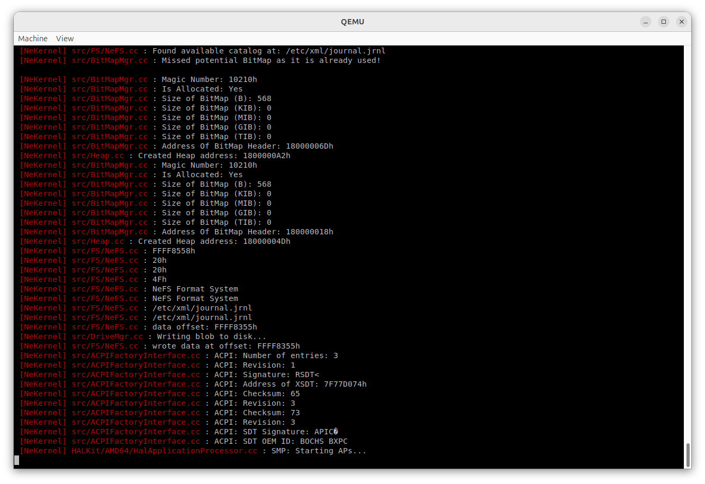
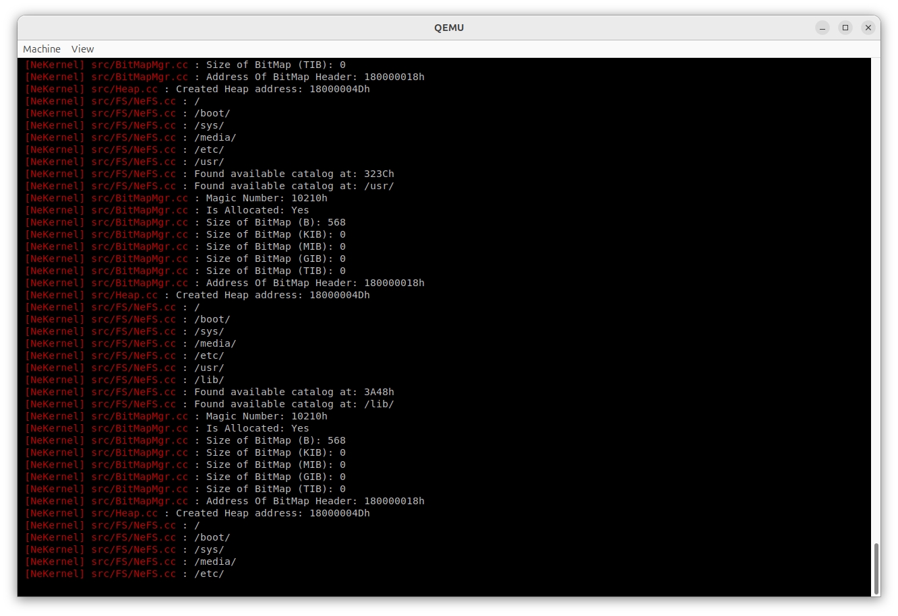

<!-- Read Me of NeKernel -->

# OpenNE


## Screenshots:

#### APIC:



#### Filesystem:



## Requirements:

- MinGW/GCC for the Kernel, Boot Loader and the LibSCI.
- Netwide Assembler for the x64 assembly files (in case you're compiling for AMD64).

## Installation:

Clone repository:

```
git clone git@github.com:amlel-el-mahrouss/openne.git
cd openne && ./setup_amd64.sh && ./debug_ata.sh
```

## License:

**Licensed under GPL v3** copyright Amlal El Mahrouss 2025, all rights reserved.
